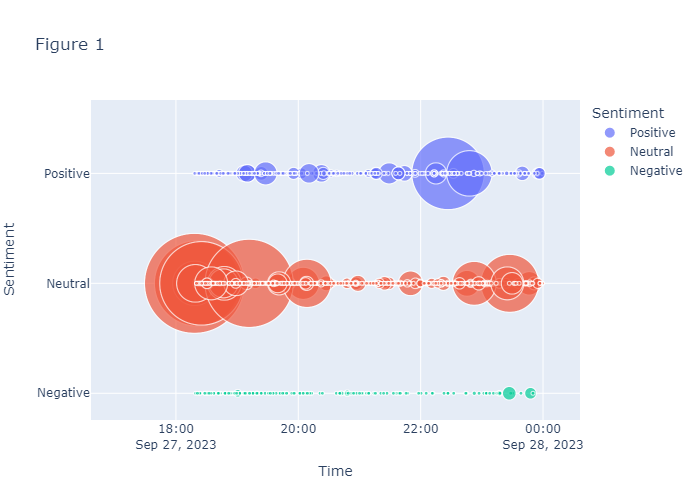
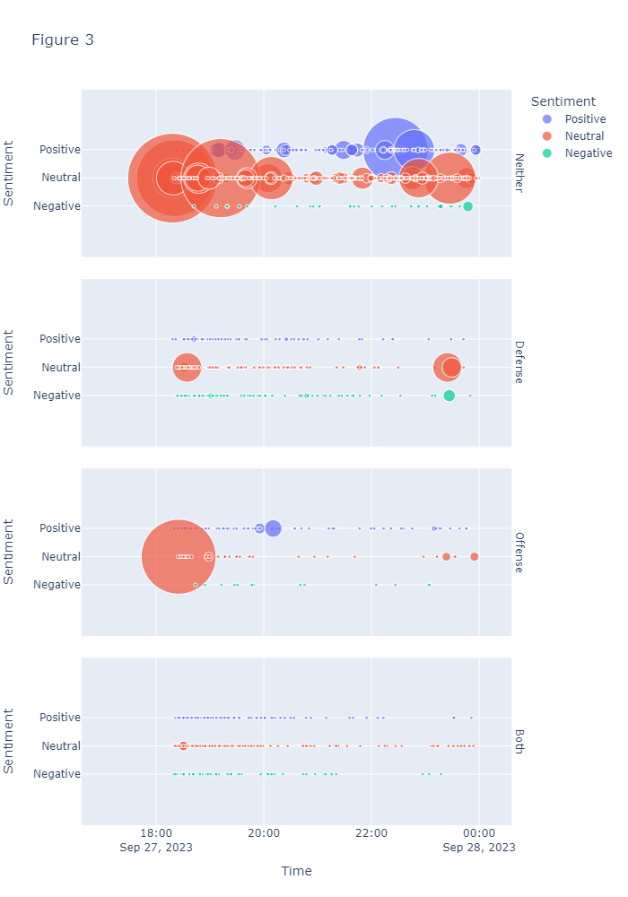

# Analysis of NBA Twitter's (X's) Reactions to NBA Trades
By Will Cameron

## Abstract
On September 27, 2023, 7x NBA All-Star Damian Lillard was traded to the Milwaukee Bucks. Predictably, NBA fans on Twitter were immediately spurred into a frenzy, filling the site with their opinions on the blockbuster trade. Now that the season has begun and there is a decent sample for Bucks games, the accuracy of their opinions can be assessed. Utilizing Selenium WebDriver, a Twitter scraper was created to collect relevant tweets posted shortly after the trade occurred. Training sets of tweet sentiment and tweet subject were created and used to train numerous candidate models. HuggingFace and Logistic Regression models emerged as the best performing for sentiment and subject respectively, allowing for classification of the full dataset of tweets. With each tweet classified with its sentiment and subject, analysis utilizing the NBA’s defensive rating, offensive rating, and net rating stats could be conducted. Using ratios of positive to negative tweets on each subject, predictions of each relevant stat for this year was calculated and compared to the real values. In general, Twitter users overestimated how good this trade was for the Milwaukee Bucks. However, each prediction was in the correct direction and simply off by magnitude, showing NBA fans on Twitter do have a fair amount of insight into the effects of NBA trades.

## Introduction
With the advent of social media, the average person can share their opinions to more people than ever before. Paired with the competitive and passionate nature of sports, social media circles discussing professional sports are often extremely reactionary, biased, and unfiltered with thousands of different perspectives chiming in. The NBA specifically has a younger and thus more active on social media fan base than other sports, leading to an even more vile discussion space on social media apps. The pinnacle of this phenomenon is NBA Twitter. Filled with genuine love and hatred for players, NBA Twitter is extremely polarized and reactionary with most people stating their opinions as fact.

With a wealth of opinions available, a “wisdom of the crowd” question emerges. If as a collective mind NBA Twitter could accurately assess parts of the game, a useful tool for scouts and general managers could emerge. The collective of people discussing a topic could do far more total research than a few people on a scouting team and potentially produce ideas not considered by teams. A scenario where this could shine would be for player trades as they can completely change the way a team or player plays and assessing trades is largely theory. If successful, analyzing Twitter sentiment could prove to be a uniquely valuable tool to teams as a way of evaluating their opponents after a trade.

## Literature Review
Currently, there is little research into the usefulness of NBA Twitter. Most of the research focuses on sports organizations and how they utilize Twitter to connect with fans. The amount of research using sentiment analysis with NBA Twitter is even smaller. Current research has focused on the NBA All-Star game voting (Su and Chen), a process done in-part by fans, or specific games (Baucom et al.) and game performances (Li, Qiwen, et al.). The research conducted in this project is unique in that it does not study anything fans interact with and is based more in theory as it is predicting NBA trades when there are no games to look at. This will allow for a more in depth look into the ability of NBA Twitter to think for itself rather than react to how players perform in specific games.

## Methodology/Dataset
Considering it was the trade that inspired this project, it seemed natural to focus on the recent Damian Lillard trade to the Milwaukee Bucks as a proof of concept. First, tweets were collected using the Selenium WebDriver. Utilizing Twitter’s advanced search, tweets related to Damian Lillard and the Milwaukee Bucks posted within a day of the trade were collected. However, using Selenium posed issues as Twitter will only load 90-100 tweets for each search, limiting the size of the final dataset and meaning multiple datasets and searches had to be combined to create the final dataset. All searches combined, the dataset reached nearly 1500 tweets. Upon creation of the dataset, 600 tweets were manually labeled with their sentiment (negative, neutral, positive) and their subject (defense, offense, both, neither) for training.

The HuggingFace transformer model twitter-roberta-base-sentiment was eventually used to classify the tweet’s sentiment. Attempts at neural networks fell victim to overfitting and the transformer outperformed Naive Bayes and Logistic Regression classifiers after being trained on the training data. Additionally, the transformer model was attractive as it had already been trained on millions of tweets and was generally familiar with the unique language of Twitter. For subject analysis, a Logistic Regression model was used as it had a surprisingly high accuracy and neural network attempts also overfit rapidly. 

To compare Twitter opinions to the actual performance of the team, the NBA’s defensive rating, offensive rating, and net rating were used. Defense rating is representative of the number of points a team allows per 100 possessions, meaning the lower, the better (“Stat Glossary”). Offensive rating is the number of points a team scores per 100 possessions, meaning the higher, the better. Net rating is the difference between these two.

## Results
Once all the tweets had been classified for sentiment and subject, graphs could be created to gain a greater understanding of how NBA Twitter reacted to the trade. **Figure 1** shows the tweets separated by sentiment. Following the initial massive announcement tweets, the opinions begin flowing in. Considering the size of the points denotes the number of likes and retweets, the positive tweets had more interaction across the board than negative tweets, possibly showing more people agreeing with these tweets. The tweets were classified at roughly 60% neutral, 30% positive, and 10% negative.

**Figure 2** shows the tweets separated by subject. Unsurprisingly, the tweets discussing neither defense or offense had the highest interaction on average due to the majority of announcement tweets falling into this category. Unlike **Figure 1**, the remaining 3 categories have more even interactions across them, with defense and offense being fairly even with each other. The tweets were classified at roughly 60% neither, 15% defense, 15% offense, and 10% both.

**Figure 3** essentially combines the previous two figures, allowing for analysis of the sentiment for tweets of each subject. From this plot we can see the defense subject is the main source of negative tweets while offense has very few. Interestingly, the neutral category consistently had the highest average interactions through all subjects.

For analysis, the neutral tweets can be removed as they lack opinion. Next, the tweets about neither offense nor defense and the tweets about both offense and defense can be combined as they both discuss the net effectiveness of the trade. Following this, a ratio of positive to negative tweets for each subject can be found, flipping it to a negative to positive ratio if there are more negative tweets than positive. Adding the defense, offense, and neither/both ratios to the Milwaukee Bucks defensive rating, offensive rating, and net rating last season respectively gave NBA Twitter’s predictions for the Bucks this season: DRTG: 113.2, ORTG: 121.7, and NRTG: 7.5. Comparing these values with the Bucks actual stats, DRTG: 115.3, ORTG: 120.5, and NRTG: 5.1 (“Teams Advanced: Stats”), gives percent errors of 1.8%, 1.0%, and 46.1% respectively.

## Discussion

The results of the study shows NBA Twitter has a certain level of insight into the effects of NBA trades. Through a small sample of tweets regarding the Damian Lillard trade to the Milwaukee Bucks, fairly accurate estimations of how the Bucks DRTG, ORTG, and NRTG would change could be made. Despite not exactly lining up with the Buck’s stats this year, Twitter users were able to accurately predict the direction these stats would go; DRTG increased, ORTG increased, and NRTG increased, just as NBA Twitter predicted. 

These results support the idea of “wisdom of the crowd” having applications to sports and social media. Despite the polarized and extreme nature of NBA Twitter, as a whole their opinions can prove useful in trade analysis.  Additionally, the models used could be improved upon with a larger dataset of tweets, meaning this project may just be scratching the surface of uses for NBA Twitter analysis. As it stands, there is evidence that sentiment and subject analysis of tweets relating to NBA trades can accurately predict the repercussions of NBA trades. Given this fact, it is likely that more aspects of the NBA could be studied using Twitter opinions.

Despite this project only analyzing NBA trades, the accuracy by which a relatively small dataset of tweets could predict NBA statistics implies there could be greater use for this concept in other parts of the game. As it stands currently, the model created in this project could be used to assist teams in creating schemes to play against teams with new rosters. When a team makes a trade, there are no games for opposing teams to study to prepare for their matchup. Creating game plans against newly assembled rosters is largely based on opinion and theory as there is no concrete evidence to review. As a result, the wealth of opinions on Twitter prove useful as they can, as a collective, accurately predict broad stroke effects of a given trade. 

With further modeling and analysis, NBA Twitter could prove to be immensely useful for almost all parts of the game. A model trained on millions of NBA related tweets could more accurately classify sentiment and subject as it learns the unique lexicon and style of NBA Twitter, potentially leading to more accurate predictions. Additionally, more specific parts of the game could be tagged as subjects and studied. During data collection, the basketball concepts of “pick and roll” and “perimeter defense” came up frequently in regards to the Damian Lillard trade. These subjects could be identified and had predictions made for their statistics based on the sentiments of relevant tweets. 

In relation to previous research, this project expands into new territory not covered in other studies. Previous research has shown that sentiment analysis can be used to accurately predict the NBA All-Star game, showing NBA Twitter’s ability to forecast real NBA happenings (Su and Chen). However, the voting for which players participate in the All-Star game is done by the fans, meaning there is a direct connection between fan sentiment towards players and their potential to be an All-Star. In this project, fans' opinions have no influence on the performance of teams after trades and is thus a unique study in that sense. Additionally, previous research has studied specific games and focused on fans’ reactions to player/team performances(Li, Qiwen, et al.)(Baucom et al.). The study conducted here does not and is thus unique in that way.

The uniqueness of this project from other studies is that it is based largely in opinion and does not address something fans can influence. As a result, this study targeted the basketball intelligence of NBA Twitter and users ability to create their own thoughts. Considering the relative accuracy by which Twitter users were able to predict the impact of Damian Lillard going to the Milwaukee Bucks, NBA Twitter could be viewed as a tool teams could use to create schemes for games. With further data collection and model creation, more elements of the NBA could be analyzed using Twitter, providing another resource teams could use to scout and prepare for games. Assuming Twitter communities have a similar level of intelligence, this technique could prove useful for nearly all competitive sports.

## Conclusion

Through sentiment and subject analysis of nearly 1500 tweets, predictions were made for the Milwaukee Bucks’ defense rating, offensive rating, and net rating after trading for Damian Lillard. These predictions were fairly close to the actual values and correctly predicted whether each value would increase or decrease. The results collected answer the research question with a resounding yes: NBA Twitter can be used to predict the outcomes of NBA trades and the “wisdom of the crowd” holds true. The research conducted here could be used as inspiration for teams to create their own models to analyze Twitter opinion for their benefit. With greater collections of data and more powerful models, NBA Twitter could prove to be accurate on many aspects of the game and assist in team’s decisions. Eventually, Twitter sentiment analysis could become a mainstay of scouting departments across all sports, possibly providing advantages by presenting a multitude of thoughts and opinions not originally considered by teams.

## References
Baucom, Eric, et al. “Mirroring the Real World in Social Media: Twitter, Geolocation, and Sentiment Analysis.” ACM Digital Library, ACM, Inc., 1 Oct. 2013, dl.acm.org/doi/abs/10.1145/2513549.2513559.

Li, Qiwen, et al. “Evaluating Performance of NBA Players with Sentiment Analysis on Twitter Messages.” ACM Digital Library, ACM, Inc., 1 Nov. 2021, dl.acm.org/doi/abs/10.1145/3501774.3501796. 

“Stat Glossary.” NBA.Com, NBA Media Ventures, LLC, 2023, www.nba.com/stats/help/glossary. 

Su, Yi-Jen, and Yue-Qun Chen. “NBA All-Star Prediction Using Twitter Sentiment Analysis.” SpringerLink, Springer International Publishing, 1 Jan. 1970, link.springer.com/chapter/10.1007/978-3-319-01796-9_20. 

“Teams Advanced: Stats.” Teams Advanced | Stats | NBA.Com, NBA Media Ventures, LLC., www.nba.com/stats/teams/advanced?CF=MIN%2AGE%2A15&dir=-1&sort=DEF_RATING. Accessed 22 Dec. 2023. 
